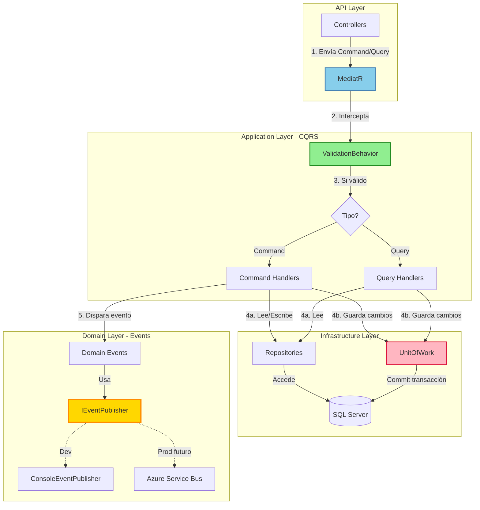

# 📦 InventoryAPI-CQRS

[](https://dotnet.microsoft.com/)
[](https://www.microsoft.com/sql-server)
[](tests/)
[](docker-compose.yml)
[](LICENSE)


> Sistema de gestión de inventario desarrollado con **ASP.NET Core 9.0** aplicando **principios SOLID**, **CQRS**, **testing avanzado** y arquitectura preparada para **entornos cloud**.

---

## 🎯 **Sobre este proyecto**

Este es mi primer proyecto **end-to-end** con ASP.NET Core donde implemento las mejores prácticas de la industria. El objetivo fue construir una API REST profesional que demuestre:

- ✅ Aplicación de **principios SOLID**
- ✅ Arquitectura **CQRS** con separación clara de responsabilidades
- ✅ Testing robusto con **Testcontainers** (simulación de infraestructura real)
- ✅ Diseño **cloud-ready** usando Docker como preparación para Azure

---

## 🏗️ **Arquitectura**



**Flujo típico de una operación:**
1. **Request** → Controller recibe DTO y crea Command/Query
2. **Validación** → MediatR pasa por ValidationBehavior con FluentValidation
3. **Procesamiento** → Handler ejecuta lógica de negocio
4. **Persistencia** → Repositories acceden a datos + UnitOfWork coordina transacciones
5. **Eventos** → Se disparan eventos de dominio (ej: stock bajo) de forma opcional

---

## 💡 **Decisiones técnicas clave**

### **1️⃣ SOLID en acción: EventPublisher plug-and-play**

El sistema de eventos implementa el **Principio de Inversión de Dependencias (DIP)**:

```csharp
// Interfaz en Domain - no depende de implementaciones
public interface IEventPublisher
{
    Task PublishAsync<TEvent>(TEvent domainEvent) where TEvent : class;
}

// Implementación actual - Consola (desarrollo)
public class ConsoleEventPublisher : IEventPublisher { ... }

// Futura implementación - Azure Service Bus (producción)
public class AzureServiceBusEventPublisher : IEventPublisher { ... }
```

**Registro en `Program.cs`:**
```csharp
// Desarrollo
builder.Services.AddScoped<IEventPublisher, ConsoleEventPublisher>();

// Producción (futuro) - solo cambiar esta línea
// builder.Services.AddScoped<IEventPublisher, AzureServiceBusEventPublisher>();
```

**¿Por qué es importante?**
- ✅ **Zero coupling**: Handlers no saben cómo se publican eventos
- ✅ **Intercambiable**: Cambio de implementación sin tocar lógica de negocio
- ✅ **Cloud-ready**: Preparado para Azure Service Bus, Event Grid, etc.

---

### **2️⃣ CQRS con MediatR: Separación de responsabilidades**

**Commands** modifican estado, **Queries** solo leen. Sin mezclas.

```csharp
Features/
├── Productos/
    ├── Commands/CreateProducto/     ← Escribe
    ├── Commands/UpdateProducto/     ← Escribe
    ├── Queries/GetProductoById/     ← Lee
    └── Queries/GetAllProductos/     ← Lee
```

**Ventajas:**
- 🎯 **Single Responsibility**: Cada handler hace UNA cosa
- 🎯 **Escalabilidad**: Queries pueden optimizarse independientemente (ej: caché, read replicas)
- 🎯 **Testeo aislado**: Testeo commands sin tocar queries

---

### **3️⃣ FluentValidation + Pipeline Behavior**

Las validaciones se ejecutan **antes** de llegar al handler gracias al pipeline de MediatR:

```csharp
public class ValidationBehavior<TRequest, TResponse> : IPipelineBehavior<TRequest, TResponse>
{
    // Intercepta TODAS las requests
    // Valida con FluentValidation
    // Si hay errores → lanza ValidationException
    // Si está OK → continúa al handler
}
```

**Resultado:**
- ✅ Handlers **siempre** reciben datos válidos
- ✅ Validaciones reutilizables y testeables
- ✅ Código limpio: handlers sin `if (string.IsNullOrEmpty(...))`

---

### **4️⃣ Docker como simulación de arquitectura cloud**

El proyecto usa Docker no solo para "empaquetar", sino para **replicar localmente** lo que sería una arquitectura en Azure:

```yaml
# docker-compose.yml
services:
  sqlserver:        # ← Simula Azure SQL Database
    image: mcr.microsoft.com/mssql/server:2022-latest
    environment:
      - ACCEPT_EULA=Y
      - SA_PASSWORD=YourStrong@Passw0rd
```

**¿Por qué Docker en desarrollo?**
- ✅ **Paridad dev/prod**: Misma BD que en Azure SQL
- ✅ **Tests realistas**: Testcontainers usa Docker → tests contra SQL Server real
- ✅ **CI/CD ready**: Mismo contenedor en GitHub Actions, Azure Pipelines, etc.

**Transición a Azure:**
```
Docker local → Azure Container Registry → Azure Container Instances/App Service
SQL Server (Docker) → Azure SQL Database
```

---

### **5️⃣ Testing con Testcontainers**

**25 tests de integración** que levantan SQL Server real en Docker:

```csharp
public class IntegrationTestBase : IAsyncLifetime
{
    private readonly MsSqlContainer _dbContainer = new MsSqlBuilder()
        .WithImage("mcr.microsoft.com/mssql/server:2022-latest")
        .Build();
    
    // Cada test tiene su propia BD limpia
}
```

**Cobertura actual:**
- ✅ **Productos**: 16 tests (CRUD + validaciones + eventos)
- ✅ **Categorías**: 3 tests
- ✅ **Proveedores**: 6 tests
- ✅ **Movimientos Stock**: 6 tests

**Tiempo de ejecución:** ~2 minutos (incluye levantar/destruir contenedores)

---

## 🛠️ **Stack tecnológico**

| Categoría | Tecnología |
|-----------|------------|
| **Framework** | ASP.NET Core 9.0 |
| **Patrones** | CQRS, Repository, Unit of Work, Domain Events |
| **Mediación** | MediatR 12.x |
| **Validación** | FluentValidation 11.x |
| **ORM** | Entity Framework Core 9.0 |
| **Base de datos** | SQL Server 2022 |
| **Testing** | xUnit + Testcontainers |
| **Contenedores** | Docker + Docker Compose |

---

## ⚡ **Características principales**

### **Gestión de Inventario**
- ✅ CRUD completo de **Productos**, **Categorías** y **Proveedores**
- ✅ **Movimientos de stock** con tipos: Entrada, Salida, Ajuste+, Ajuste-
- ✅ Generación automática de SKU para productos
- ✅ Control de stock mínimo con eventos de alerta

### **Arquitectura**
- ✅ **CQRS** con MediatR para separación Commands/Queries
- ✅ **Repository Pattern** + **Unit of Work** para transaccionalidad
- ✅ **Domain Events** para notificaciones (stock bajo, etc.)
- ✅ **Pipeline Behavior** para validaciones automáticas

### **Validaciones**
- ✅ FluentValidation en todos los Commands
- ✅ Validación de reglas de negocio en Handlers
- ✅ Respuestas estructuradas con errores claros

### **Testing**
- ✅ 25 tests de integración con Testcontainers
- ✅ Tests contra SQL Server real (no mocks)
- ✅ Cobertura de happy paths y casos de error

---

## 🚀 **Quick Start**

### **Prerrequisitos**
- .NET 9.0 SDK
- Docker Desktop

### **1. Clonar repositorio**
```bash
git clone https://github.com/Kvr0th3c4t/InventoryAPI-CQRS.git
cd InventoryAPI-CQRS
```

### **2. Levantar base de datos con Docker**
```bash
docker-compose up -d
```

### **3. Ejecutar migraciones**
```bash
cd src/InventoryAPI
dotnet ef database update
```

### **4. Ejecutar la API**
```bash
dotnet run
```

La API estará disponible en: **https://localhost:5001/swagger**

---

## 🧪 **Ejecutar tests**

```bash
cd tests/InventoryAPI.IntegrationTests
dotnet test
```

**Salida esperada:**
```
Passed!  - Failed:     0, Passed:    25, Skipped:     0, Total:    25
Time:   ~2 min
```

Los tests levantarán automáticamente un contenedor SQL Server, ejecutarán las pruebas y limpiarán los recursos.

---

## 📡 **Ejemplos de uso**

### **Crear un producto**
```bash
POST /api/productos
Content-Type: application/json

{
  "nombre": "Laptop HP",
  "descripcion": "Laptop empresarial",
  "categoriaId": 1,
  "precio": 899.99,
  "stockActual": 50,
  "stockMinimo": 10
}
```

**Respuesta:**
```json
{
  "id": 1,
  "nombre": "Laptop HP",
  "sku": "PROD-00001",  // ← Generado automáticamente
  "stockActual": 50,
  "fechaCreacion": "2024-11-18T10:30:00Z"
}
```

### **Registrar movimiento de stock**
```bash
POST /api/movimientos-stock
Content-Type: application/json

{
  "productoId": 1,
  "tipo": "Salida",  // Entrada | Salida | AjustePositivo | AjusteNegativo
  "cantidad": 45,
  "razon": "Venta cliente corporativo"
}
```

**Si el stock queda por debajo del mínimo:**
```
🔔 Evento disparado: StockBajoEvent
Producto: Laptop HP (SKU: PROD-00001)
Stock actual: 5 | Stock mínimo: 10
```

---

## 📂 **Estructura del proyecto**

```
InventoryAPI-CQRS/
├── src/
│   └── InventoryAPI/
│       ├── Controllers/           # Endpoints REST
│       ├── Features/              # CQRS - Commands y Queries
│       │   ├── Productos/
│       │   ├── Categorias/
│       │   ├── Proveedores/
│       │   └── MovimientosStock/
│       ├── Validation/            # FluentValidation + Behavior
│       ├── Models/                # Entidades de dominio
│       ├── DTOs/                  # Data Transfer Objects
│       ├── Repositories/          # Acceso a datos
│       ├── UnitOfWork/            # Patrón Unit of Work
│       ├── Events/                # Domain Events + Publisher
│       └── Data/                  # DbContext + Migrations
│
└── tests/
    └── InventoryAPI.IntegrationTests/  # Tests con Testcontainers
```

---

## 🎓 **Conceptos demostrados**

Este proyecto es un showcase de:

### **Principios SOLID**
- **S** - Handlers con responsabilidad única
- **O** - Extensible vía interfaces (IEventPublisher, IRepository)
- **L** - Repositories intercambiables respetando contratos
- **I** - Interfaces segregadas (IProductoRepository vs IGenericRepository)
- **D** - Dependencias de abstracciones, no implementaciones

### **Patrones de diseño**
- **CQRS** - Separación lectura/escritura
- **Mediator** - MediatR desacopla controllers de handlers
- **Repository** - Abstrae acceso a datos
- **Unit of Work** - Coordina transacciones
- **Domain Events** - Notificaciones asíncronas

### **Testing avanzado**
- Integration tests con infraestructura real
- Testcontainers para reproducibilidad
- Arrange-Act-Assert pattern

### **Cloud-ready**
- Dockerizado y listo para Azure
- Configuración separada por ambiente
- Preparado para CI/CD

---

## 📬 **Contacto**

**Adrián** - Desarrollador Full-Stack .NET

[](https://github.com/Kvr0th3c4t)
[](https://www.linkedin.com/in/adrian-carmonamad/)

---

## 📄 **Licencia**

Este proyecto está bajo la licencia MIT. Ver [LICENSE](LICENSE) para más detalles.

---

<div align="center">
  <p><strong>⭐ Si este proyecto te resulta útil, considera darle una estrella</strong></p>
  <p><em>Desarrollado como portfolio de buenas prácticas en ASP.NET Core</em></p>
</div>
